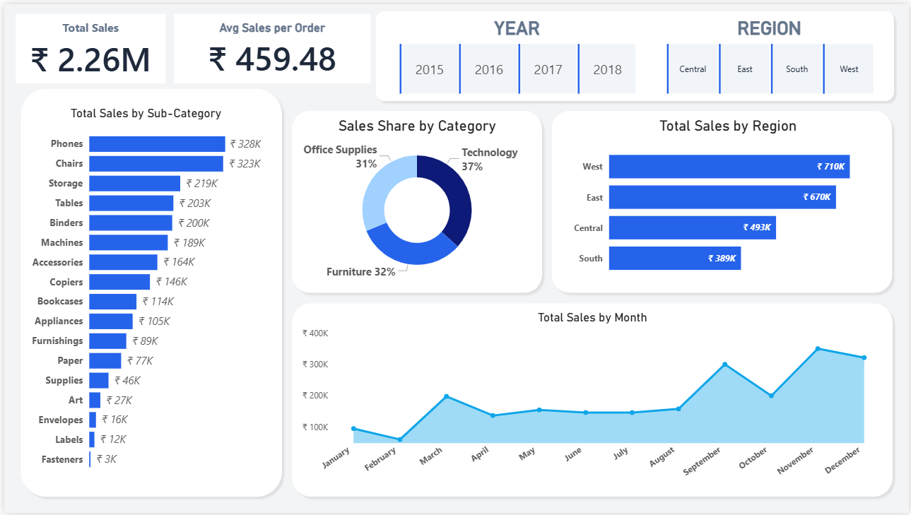
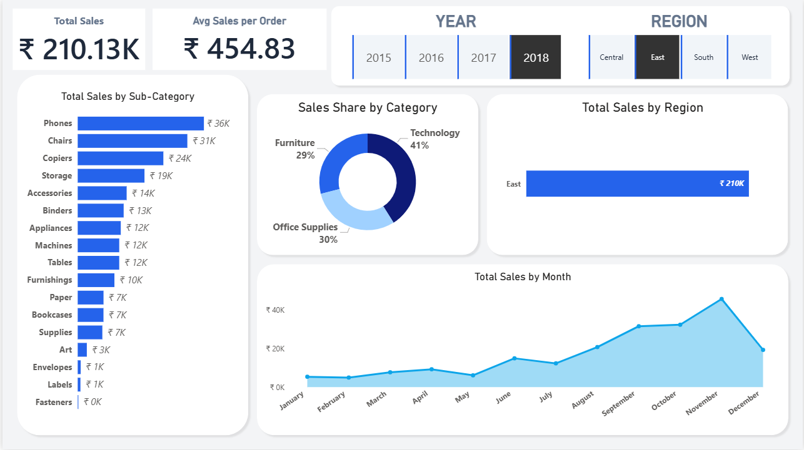
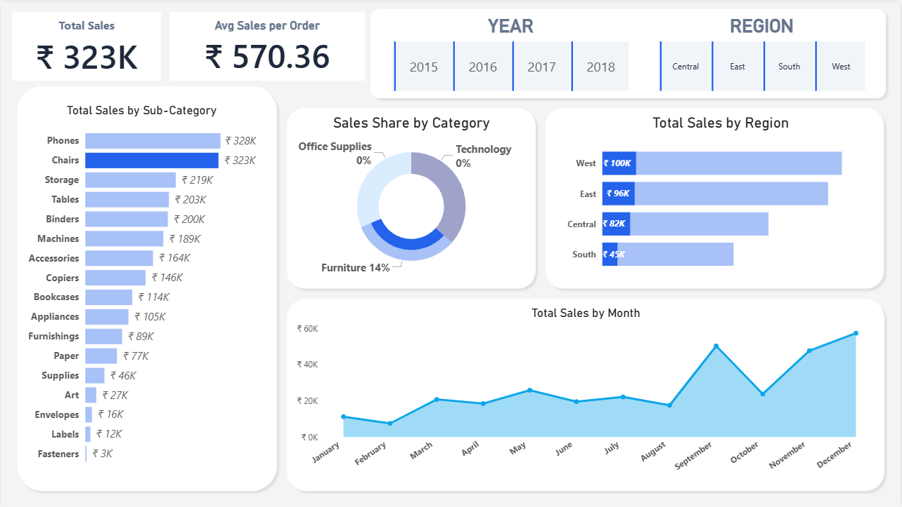

# Sales Insights Dashboard (Power BI)

This project presents a Sales Insights Dashboard built using Power BI to analyze overall sales performance.

## Dataset
Superstore Sales Dataset (CSV)

## Key KPIs
- Total Sales
- Average Sales per Order

## Visual Analysis
- Sales trend by month
- Sales distribution by category
- Sales performance by region
- Sub-category level sales analysis

## Tools Used
- Power BI
- DAX (basic measures)

## Dashboard 

